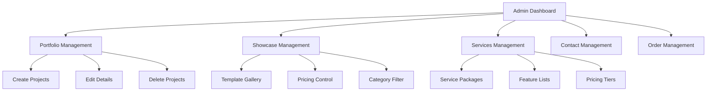
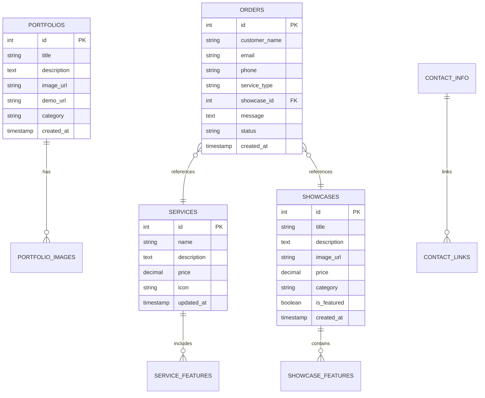
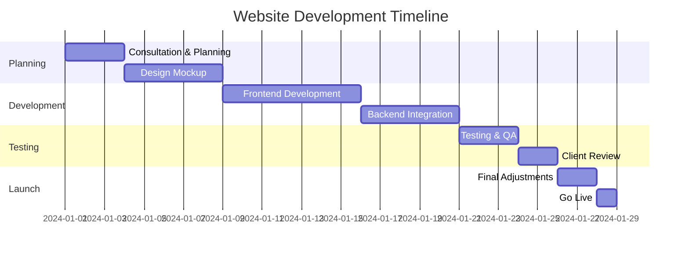
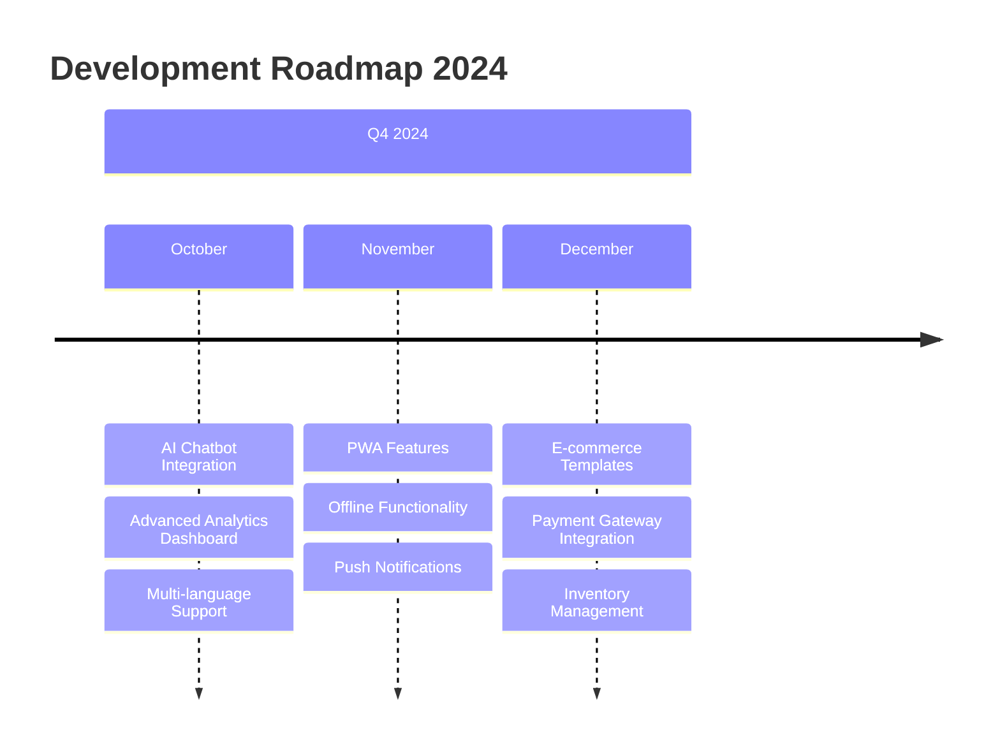

# 🌟 OrbWeb Studio - Website Development Services

<div align="center">


[](https://reactjs.org/)
[](https://www.typescriptlang.org/)
[](https://tailwindcss.com/)
[](https://supabase.com/)
[](https://vitejs.dev/)

[](https://orbweb-studio.vercel.app)
[](https://wa.me/628123456789)
[](mailto:info@orbweb.studio)

</div>

---

<div align="center">

### 📊 Project Statistics


**150+** Websites Completed 🚀 | **98%** Client Satisfaction 😊 | **24hr** Response Time ⏰ | **5+** Years Experience 📈

</div>

## 🚀 Tentang OrbWeb Studio

> **Website Development Services Terdepan** - Perusahaan pengembangan web profesional yang mengkhususkan diri dalam pembuatan website modern, responsif, dan berkualitas tinggi.

<table>
  <tr>
    <td>
      <h3>🎯 Spesialisasi Kami</h3>
      <ul>
        <li>🌐 Custom Website Development</li>
        <li>📱 Mobile-First Responsive Design</li>
        <li>🛒 E-commerce Solutions</li>
        <li>🔍 SEO Optimization</li>
        <li>⚡ Performance Optimization</li>
      </ul>
    </td>
    <td>
      <h3>💼 Industri Experience</h3>
      <ul>
        <li>🏢 Corporate Websites</li>
        <li>🏪 Online Stores</li>
        <li>📰 News Portals</li>
        <li>🎨 Portfolio Sites</li>
        <li>📚 Educational Platforms</li>
      </ul>
    </td>
  </tr>
</table>

---

## ✨ Fitur Utama

<details>
<summary>🏠 <strong>Halaman Publik</strong> <em>(Click to expand)</em></summary>

### 📋 Halaman yang Tersedia:

| Halaman | Deskripsi | Status |
|---------|-----------|---------|
| **🏠 Home Page** | Hero section dengan company introduction | ✅ Ready |
| **⚙️ Services Page** | Detailed service packages dengan pricing | ✅ Ready |
| **💼 Portfolio Page** | Showcase proyek yang telah selesai | ✅ Ready |
| **🛍️ Showcase Page** | Template gallery dengan kategori | ✅ Ready |
| **📞 Contact Page** | Dynamic contact form | ✅ Ready |

#### 🎨 Design Features:
- 📱 **Mobile-First Design** - Responsive di semua device
- 🎭 **Modern UI/UX** - Clean & professional design
- ⚡ **Fast Loading** - Optimized performance
- 🔍 **SEO Friendly** - Search engine optimized

</details>

<details>
<summary>🔐 <strong>Admin Panel</strong> <em>(Click to expand)</em></summary>

### 🛠️ Management Features:



#### 🔧 Admin Capabilities:
- ✏️ **CRUD Operations** - Full content management
- 📊 **Real-time Analytics** - Track website performance  
- 📝 **Order Processing** - Handle customer requests
- 🎯 **SEO Tools** - Meta tags & content optimization

</details>

<details>
<summary>⚡ <strong>Fitur Teknis</strong> <em>(Click to expand)</em></summary>

### 🔧 Tech Stack & Features:

<div align="center">

| Frontend | Backend | Database | Deployment |
|----------|---------|----------|------------|
|  |  |  |  |
|  |  |  |  |
|  |  |  |  |

</div>

#### 🚀 Performance Features:
- ⚡ **Fast Loading** - Optimized with Vite bundler
- 📱 **PWA Ready** - Progressive Web App capabilities
- 🔒 **Security First** - JWT authentication & HTTPS
- 🔍 **SEO Optimized** - Meta tags & structured data
- 📊 **Analytics Ready** - Google Analytics integration

</details>

---

## 🛠️ Quick Start Guide

<details>
<summary>📦 <strong>Installation</strong> <em>(Step by step)</em></summary>

### Prerequisites checklist:
- [ ] Node.js 18+ installed
- [ ] Git installed  
- [ ] Supabase account created
- [ ] Code editor ready

### 🚀 Installation Steps:

#### 1️⃣ **Clone Repository**
```bash
# Clone the repository
git clone https://github.com/orbweb-studio/website.git
cd orbweb-studio-website

# Check if clone successful
ls -la
```

#### 2️⃣ **Install Dependencies**  
```bash
# Install all required packages
npm install

# Verify installation
npm list --depth=0
```

#### 3️⃣ **Environment Setup**
```bash
# Create environment file
cp .env.example .env

# Edit the .env file with your credentials
nano .env
```

```env
# Supabase Configuration
VITE_SUPABASE_URL=https://your-project.supabase.co
VITE_SUPABASE_ANON_KEY=your-anon-key-here

# Optional: Analytics
VITE_GA_MEASUREMENT_ID=G-XXXXXXXXXX
```

#### 4️⃣ **Database Setup**
```sql
-- Execute this in Supabase SQL Editor
-- Copy from database_setup.sql file

CREATE TABLE portfolios (
  id SERIAL PRIMARY KEY,
  title VARCHAR(255) NOT NULL,
  description TEXT,
  image_url VARCHAR(500),
  demo_url VARCHAR(500),
  category VARCHAR(100),
  created_at TIMESTAMP DEFAULT NOW()
);

-- Additional tables...
INSERT INTO portfolios (title, description, category) VALUES 
('Modern E-commerce', 'Full-stack online store with payment integration', 'E-commerce'),
('Corporate Website', 'Professional business website with CMS', 'Corporate');
```

#### 5️⃣ **Start Development**
```bash
# Run development server
npm run dev

# Server will start at http://localhost:5173
```

#### 6️⃣ **Build for Production**
```bash
# Create optimized build
npm run build

# Preview production build
npm run preview
```

### ✅ **Verification Steps:**
1. Open browser to `http://localhost:5173`
2. Check console for errors
3. Test admin login functionality
4. Verify database connections

</details>

---

## 🗄️ Database Schema

<details>
<summary>📊 <strong>Database Structure</strong> <em>(Tables & Relationships)</em></summary>

### 🔗 Entity Relationship Diagram:



### 📋 Table Details:

| Table | Purpose | Key Features |
|-------|---------|--------------|
| **📁 portfolios** | Project showcase | Category filtering, demo links |
| **🛍️ showcases** | Template sales | Pricing, featured templates |
| **⚙️ services** | Service packages | Dynamic pricing, feature lists |
| **📞 contact_info** | Contact management | Multi-platform support |
| **📋 orders** | Customer inquiries | Status tracking, notifications |

### 🔐 Security Features:
- **Row Level Security (RLS)** enabled on all tables
- **API Authentication** via Supabase Auth
- **Input Validation** on all user inputs
- **SQL Injection Protection** built-in

</details>

---

## 🎨 Design System

<details>
<summary>🎨 <strong>Visual Identity</strong> <em>(Colors, Typography, Components)</em></summary>

### 🌈 Color Palette:

<table>
  <tr>
    <td>
      <strong>🔵 Primary Colors</strong><br>
      <code>#667eea</code> 🔵 Blue<br>
      <code>#764ba2</code> 🟣 Purple<br>
    </td>
    <td>
      <strong>🎯 Accent Colors</strong><br>
      <code>#25d366</code> 🟢 WhatsApp Green<br>
      <code>#1877f2</code> 🔵 Facebook Blue<br>
    </td>
    <td>
      <strong>⚫ Neutral Colors</strong><br>
      <code>#333333</code> ⚫ Dark Text<br>
      <code>#666666</code> ⚫ Light Text<br>
      <code>#f8f9fa</code> ⚪ Background<br>
    </td>
  </tr>
</table>

### ✏️ Typography:

```css
/* Font Stack */
font-family: -apple-system, BlinkMacSystemFont, 
             'Segoe UI', Roboto, sans-serif;

/* Heading Scales */
h1: 3.5rem   /* 56px - Hero titles */
h2: 2.5rem   /* 40px - Section headers */
h3: 1.75rem  /* 28px - Card titles */
h4: 1.25rem  /* 20px - Subsections */

/* Responsive breakpoints */
Mobile:  < 768px
Tablet:  768px - 1024px  
Desktop: > 1024px
```

### 🧩 Component Library:

| Component | Variants | Usage |
|-----------|----------|-------|
| **🔘 Button** | Primary, Secondary, Ghost | CTAs, Navigation |
| **📇 Card** | Default, Hover, Featured | Content blocks |
| **📝 Input** | Text, Email, Textarea | Forms |
| **🔄 Modal** | Small, Medium, Large | Overlays |
| **🏷️ Badge** | Success, Warning, Error | Status indicators |

</details>

---

## 📱 Page Overview

<details>
<summary>🔍 <strong>Page Structure</strong> <em>(Detailed breakdown)</em></summary>

### 🏠 **Home Page** (`/`)
```
├── 🎯 Hero Section
│   ├── Company Introduction
│   ├── Typing Animation Effect
│   └── CTA Buttons (WhatsApp/Email)
├── 🌟 Featured Showcases
│   ├── Template Carousel
│   └── "View All" Link
├── 📞 Contact Quick Access
│   ├── WhatsApp Integration  
│   ├── Email Contact
│   └── Response Time Display
├── 💬 Client Testimonials
│   ├── Rotating Reviews
│   └── Star Ratings
└── 🚀 Call-to-Action Sections
```

### ⚙️ **Services Page** (`/services`)
```
├── 📋 Service Packages Grid
│   ├── Basic Package
│   ├── Premium Package  
│   └── Enterprise Package
├── 💰 Pricing Comparison Table
├── ➕ Additional Services
│   ├── SEO Optimization
│   ├── Maintenance Plans
│   └── Custom Development
└── 📝 Contact Form Integration
```

### 💼 **Portfolio Page** (`/portfolio`)
```
├── 🎯 Filter by Category
│   ├── All Projects
│   ├── E-commerce
│   ├── Corporate
│   └── Personal
├── 🖼️ Project Grid Display
│   ├── Project Thumbnails
│   ├── Hover Effects
│   └── Quick Info
├── 🔍 Project Detail Modal
│   ├── Full Description
│   ├── Technology Stack
│   ├── Demo Link
│   └── Case Study
└── 📊 Load More Functionality
```

### 🛍️ **Showcase Page** (`/showcase`)
```
├── 🏷️ Category Filter
│   ├── Basic Templates ($50-$100)
│   ├── Premium Templates ($100-$250)
│   └── Enterprise Templates ($250+)
├── ⭐ Featured Templates Section
├── 🛒 Template Grid
│   ├── Preview Images
│   ├── Live Demo Links
│   ├── Feature Lists
│   └── Purchase Buttons
└── 🔄 Template Comparison Tool
```

### 📞 **Contact Page** (`/contact`)
```
├── 📋 Contact Information
│   ├── Dynamic Contact Cards
│   ├── Social Media Links
│   └── Business Hours
├── 📝 Order Form
│   ├── Service Selection
│   ├── Template Selection (if applicable)
│   ├── Project Details
│   └── Budget Range
├── 🗺️ Location Map (Optional)
└── ⚡ Quick Response Promise
```

### 🔐 **Admin Panel** (`/admin`)
```
├── 📊 Dashboard Overview
│   ├── Order Statistics
│   ├── Recent Activities
│   └── Quick Actions
├── 💼 Portfolio Management
│   ├── Add/Edit/Delete Projects
│   ├── Category Management
│   └── Image Upload
├── 🛍️ Showcase Management
│   ├── Template CRUD Operations
│   ├── Pricing Control
│   └── Feature Management
├── ⚙️ Services Management
│   ├── Package Configuration
│   ├── Feature Lists
│   └── Pricing Updates
├── 📞 Contact Information
│   ├── Dynamic Contact Setup
│   ├── Social Media Links
│   └── Business Info
└── 📋 Orders Management
    ├── New Orders Queue
    ├── In Progress Projects
    ├── Completed Orders
    └── Customer Communication
```

</details>

---

## 🚀 Deployment Guide

<details>
<summary>☁️ <strong>Deployment Options</strong> <em>(Multiple platforms)</em></summary>

### 🔷 **Vercel Deployment** (Recommended)

#### Automatic Deployment:
```bash
# 1. Connect GitHub to Vercel
# 2. Import your repository
# 3. Configure environment variables
# 4. Deploy automatically on push

# Environment Variables in Vercel:
VITE_SUPABASE_URL=https://your-project.supabase.co
VITE_SUPABASE_ANON_KEY=your-anon-key
```

#### Manual Deployment:
```bash
# Install Vercel CLI
npm install -g vercel

# Login to Vercel
vercel login

# Deploy project
vercel --prod

# Set environment variables
vercel env add VITE_SUPABASE_URL production
vercel env add VITE_SUPABASE_ANON_KEY production
```

### 🔶 **Netlify Deployment**

#### Via Git Integration:
1. Connect repository to Netlify
2. Build settings:
   - **Build command:** `npm run build`
   - **Publish directory:** `dist`
3. Environment variables setup
4. Enable form handling for contact forms

#### Manual Deployment:
```bash
# Install Netlify CLI  
npm install -g netlify-cli

# Login to Netlify
netlify login

# Deploy to draft URL
netlify deploy

# Deploy to production
netlify deploy --prod --dir=dist
```

### 🔸 **GitHub Pages Deployment**

```yaml
# .github/workflows/deploy.yml
name: Deploy to GitHub Pages

on:
  push:
    branches: [ main ]

jobs:
  build-and-deploy:
    runs-on: ubuntu-latest
    steps:
    - uses: actions/checkout@v2
    
    - name: Setup Node.js
      uses: actions/setup-node@v2
      with:
        node-version: '18'
        
    - name: Install dependencies
      run: npm install
      
    - name: Build
      run: npm run build
      env:
        VITE_SUPABASE_URL: ${{ secrets.VITE_SUPABASE_URL }}
        VITE_SUPABASE_ANON_KEY: ${{ secrets.VITE_SUPABASE_ANON_KEY }}
        
    - name: Deploy
      uses: peaceiris/actions-gh-pages@v3
      with:
        github_token: ${{ secrets.GITHUB_TOKEN }}
        publish_dir: ./dist
```

### 🔴 **DigitalOcean App Platform**

```yaml
# .do/app.yaml
name: orbweb-studio
services:
- name: web
  source_dir: /
  github:
    repo: your-username/orbweb-studio
    branch: main
  run_command: npm start
  environment_slug: node-js
  instance_count: 1
  instance_size_slug: basic-xxs
  envs:
  - key: VITE_SUPABASE_URL
    value: https://your-project.supabase.co
  - key: VITE_SUPABASE_ANON_KEY
    value: your-anon-key
```

### ⚡ **Performance Optimization**

#### Build Optimization:
```json
// vite.config.js
export default {
  build: {
    rollupOptions: {
      output: {
        manualChunks: {
          vendor: ['react', 'react-dom'],
          supabase: ['@supabase/supabase-js']
        }
      }
    },
    chunkSizeWarningLimit: 1000
  }
}
```

#### CDN Setup:
- **Cloudflare**: Free CDN with SSL
- **AWS CloudFront**: Enterprise-grade CDN
- **KeyCDN**: Developer-friendly CDN

</details>

---

## 🔒 Security & Performance

<details>
<summary>🛡️ <strong>Security Features</strong> <em>(Protection & Best Practices)</em></summary>

### 🔐 **Authentication & Authorization**

#### Supabase Auth Features:
- **JWT Tokens** - Secure session management
- **Row Level Security (RLS)** - Database-level protection
- **OAuth Integration** - Google, GitHub, Facebook login
- **Magic Links** - Passwordless authentication

#### Security Policies:
```sql
-- Example RLS Policy
CREATE POLICY "Users can only see their own orders" ON orders
  FOR SELECT USING (auth.uid() = user_id);

CREATE POLICY "Admin full access" ON portfolios
  FOR ALL USING (auth.jwt() ->> 'role' = 'admin');
```

### 🛡️ **Data Protection**

| Security Layer | Implementation | Status |
|----------------|----------------|--------|
| **HTTPS Enforcement** | SSL/TLS certificates | ✅ Active |
| **XSS Protection** | Content Security Policy | ✅ Active |
| **CSRF Protection** | SameSite cookies | ✅ Active |
| **Input Validation** | Client & server-side | ✅ Active |
| **SQL Injection** | Parameterized queries | ✅ Active |

### ⚡ **Performance Monitoring**

#### Core Web Vitals:
- **LCP (Largest Contentful Paint)**: < 2.5s ✅
- **FID (First Input Delay)**: < 100ms ✅  
- **CLS (Cumulative Layout Shift)**: < 0.1 ✅

#### Optimization Features:
```typescript
// Code splitting example
const AdminPanel = lazy(() => import('./components/AdminPanel'));
const Portfolio = lazy(() => import('./pages/Portfolio'));

// Image optimization
const optimizedImage = {
  loading: 'lazy',
  decoding: 'async',
  sizes: '(max-width: 768px) 100vw, 50vw'
};
```

### 📊 **Monitoring Tools**

#### Built-in Analytics:
- **Supabase Analytics** - Database performance
- **Vercel Analytics** - Website performance  
- **Google Analytics 4** - User behavior
- **Error Tracking** - Sentry integration ready

#### Health Checks:
```bash
# Automated testing
npm run test          # Unit tests
npm run test:e2e      # End-to-end tests
npm run lighthouse    # Performance audit
npm run security      # Security scan
```

</details>

---

## 🤝 Contributing

<details>
<summary>👥 <strong>Development Guidelines</strong> <em>(How to contribute)</em></summary>

### 🔄 **Development Workflow**

```bash
# 1. Fork the repository
git clone https://github.com/your-username/orbweb-studio.git

# 2. Create feature branch
git checkout -b feature/new-feature-name

# 3. Make your changes
# ... code changes ...

# 4. Run tests
npm run test
npm run lint

# 5. Commit with conventional commits
git commit -m "feat: add new portfolio filter feature"

# 6. Push and create PR
git push origin feature/new-feature-name
```

### 📝 **Commit Convention**

| Type | Description | Example |
|------|-------------|---------|
| `feat` | New feature | `feat: add testimonial carousel` |
| `fix` | Bug fix | `fix: resolve mobile navigation issue` |
| `docs` | Documentation | `docs: update installation guide` |
| `style` | Code formatting | `style: format components with prettier` |
| `refactor` | Code restructuring | `refactor: optimize database queries` |
| `test` | Testing | `test: add portfolio component tests` |

### 🧪 **Testing Guidelines**

#### Unit Tests:
```bash
# Run unit tests
npm run test

# Watch mode for development
npm run test:watch

# Coverage report
npm run test:coverage
```

#### E2E Tests:
```bash
# Install Playwright
npm run test:e2e:install

# Run E2E tests  
npm run test:e2e

# Debug mode
npm run test:e2e:debug
```

### 📋 **Code Standards**

#### TypeScript Configuration:
```json
{
  "compilerOptions": {
    "strict": true,
    "noUnusedLocals": true,
    "noUnusedParameters": true,
    "exactOptionalPropertyTypes": true
  }
}
```

#### ESLint Rules:
```json
{
  "extends": [
    "@typescript-eslint/recommended",
    "plugin:react-hooks/recommended"
  ],
  "rules": {
    "prefer-const": "error",
    "no-unused-vars": "error"
  }
}
```

### 🎯 **Contribution Areas**

- 🐛 **Bug Fixes** - Issues labeled `bug`
- ✨ **New Features** - Issues labeled `enhancement`
- 📚 **Documentation** - Improve guides and examples
- 🎨 **UI/UX** - Design improvements
- ⚡ **Performance** - Speed optimizations
- 🔒 **Security** - Security enhancements

</details>

---

## 📞 Support & Contact

<div align="center">

### 💬 Get in Touch

[](https://wa.me/628123456789?text=Hi%20OrbWeb%20Studio,%20I'm%20interested%20in%20your%20services!)
[](mailto:info@orbweb.studio?subject=Project%20Inquiry&body=Hi%20OrbWeb%20Studio,%0D%0A%0D%0AI'm%20interested%20in%20discussing%20a%20project.%0D%0A%0D%0AProject%20Type:%20%0D%0ABudget%20Range:%20%0D%0ATimeline:%20%0D%0A%0D%0APlease%20let%20me%20know%20your%20availability.%0D%0A%0D%0AThank%20you!)

</div>

<details>
<summary>📞 <strong>Contact Information</strong> <em>(All channels)</em></summary>

### 🌐 **Business Information**

| Contact Type | Details | Availability |
|--------------|---------|--------------|
| 📧 **Email** | info@orbweb.studio | 24/7 (Response within 24hrs) |
| 💬 **WhatsApp** | +62 812-3456-7890 | Mon-Fri: 9AM-6PM WIB |
| 📱 **Telegram** | @orbwebstudio | Mon-Fri: 9AM-6PM WIB |
| 🌍 **Website** | https://orbweb.studio | 24/7 Online |

### 📍 **Office Location**
```
OrbWeb Studio
Jl. Technological Innovation No. 123
Bandung, West Java 40132
Indonesia 🇮🇩
```

### 💼 **Business Hours**
- **Monday - Friday**: 09:00 - 18:00 WIB
- **Saturday**: 09:00 - 15:00 WIB  
- **Sunday**: Closed (Emergency support available)

### ⚡ **Response Time Promise**
- **WhatsApp**: Within 2 hours (business hours)
- **Email**: Within 24 hours
- **Emergency Support**: Within 1 hour

### 🎯 **Project Inquiry Template**

When contacting us, please include:
- 📋 **Project Type**: Website, E-commerce, Landing Page, etc.
- 💰 **Budget Range**: Help us provide suitable solutions
- ⏰ **Timeline**: When do you need it completed?
- 🎨 **Design Preferences**: Modern, Classic, Minimalist, etc.
- 📱 **Special Requirements**: Mobile app, SEO, multilingual, etc.

### 🆘 **Technical Support**

| Issue Type | Contact Method | Response Time |
|------------|----------------|---------------|
| 🚨 **Critical Issues** | WhatsApp + Email | 1 hour |
| ⚠️ **Bug Reports** | Email with details | 4 hours |
| 💡 **Feature Requests** | Email or GitHub Issue | 24 hours |
| ❓ **General Questions** | WhatsApp or Email | 2 hours |

</details>

---

## 📋 FAQ

<details>
<summary>❓ <strong>Frequently Asked Questions</strong> <em>(Common queries)</em></summary>

### 💰 **Pricing & Packages**

<details>
<summary><strong>Q: Berapa harga pembuatan website?</strong></summary>

**A:** Harga bervariasi tergantung kompleksitas:

| Package | Price Range | Features |
|---------|-------------|----------|
| **🏠 Basic** | $500 - $1,000 | Landing page, responsive design |
| **💼 Professional** | $1,000 - $3,000 | Multi-page, CMS, SEO optimized |
| **🚀 Enterprise** | $3,000 - $10,000 | Custom features, e-commerce, admin panel |

*Harga dalam USD, pembayaran bisa dalam Rupiah*
</details>

<details>
<summary><strong>Q: Apakah ada paket maintenance?</strong></summary>

**A:** Ya, kami menyediakan paket maintenance:
- **🔧 Basic Maintenance**: $50/month - Updates, backup, monitoring
- **⚡ Pro Maintenance**: $100/month - + Content updates, SEO reports  
- **🚀 Enterprise**: $200/month - + Feature additions, priority support
</details>

### ⏰ **Timeline & Process**

<details>
<summary><strong>Q: Berapa lama proses pembuatan website?</strong></summary>

**A:** Timeline tergantung kompleksitas:



- **🏠 Basic Website**: 1-2 minggu
- **💼 Professional Website**: 2-4 minggu  
- **🚀 Enterprise Solution**: 4-8 minggu
</details>

<details>
<summary><strong>Q: Bagaimana proses pengembangan website?</strong></summary>

**A:** Proses pengembangan kami:

1. **📋 Konsultasi** - Diskusi requirement dan budget
2. **🎨 Design** - Mockup dan prototype  
3. **⚡ Development** - Coding dan integrasi
4. **🧪 Testing** - QA dan bug fixing
5. **🚀 Launch** - Deploy dan go live
6. **📈 Support** - Maintenance dan updates
</details>

### 🛠️ **Technical Questions**

<details>
<summary><strong>Q: Teknologi apa yang digunakan?</strong></summary>

**A:** Tech stack modern yang kami gunakan:

**Frontend:**
- ⚛️ **React 18** - Modern UI library
- 🔷 **TypeScript** - Type-safe development
- 🎨 **Tailwind CSS** - Utility-first styling
- ⚡ **Vite** - Fast build tool

**Backend:**
- 🟢 **Node.js** - JavaScript runtime
- 🗄️ **Supabase** - Backend-as-a-Service
- 🐘 **PostgreSQL** - Reliable database
- 🔐 **JWT** - Secure authentication

**Deployment:**
- ▲ **Vercel** - Edge deployment
- 🌐 **Netlify** - JAMstack hosting
- ☁️ **AWS** - Cloud infrastructure
</details>

<details>
<summary><strong>Q: Apakah website akan mobile-friendly?</strong></summary>

**A:** Ya, semua website kami:
- 📱 **Mobile-First Design** - Prioritas mobile experience
- 🖥️ **Responsive Layout** - Adaptif di semua ukuran layar
- ⚡ **Fast Loading** - Optimized untuk mobile network
- 👆 **Touch-Friendly** - Easy navigation di mobile
- 🔍 **Mobile SEO** - Google mobile-first indexing ready
</details>

### 🔒 **Security & Maintenance**

<details>
<summary><strong>Q: Bagaimana keamanan website dijamin?</strong></summary>

**A:** Langkah keamanan yang kami terapkan:

- 🔐 **SSL Certificate** - HTTPS encryption
- 🛡️ **Firewall Protection** - DDoS protection  
- 🔒 **Secure Authentication** - JWT + 2FA
- 📊 **Regular Backups** - Daily automated backups
- 🔄 **Security Updates** - Regular patches
- 🚨 **Monitoring** - 24/7 security monitoring
</details>

<details>
<summary><strong>Q: Apakah source code diberikan ke klien?</strong></summary>

**A:** Ya, kami memberikan:
- 📁 **Complete Source Code** - Full project files
- 📚 **Documentation** - Setup dan maintenance guide
- 🔑 **Database Access** - Admin credentials
- 🎯 **Training Session** - How to manage content
- 📞 **Support Period** - 3 bulan gratis support
</details>

### 💳 **Payment & Legal**

<details>
<summary><strong>Q: Bagaimana sistem pembayaran?</strong></summary>

**A:** Opsi pembayaran fleksibel:

**💰 Payment Methods:**
- 🏧 **Bank Transfer** - BCA, Mandiri, BRI, BNI
- 💳 **E-Wallet** - GoPay, OVO, Dana, LinkAja
- 💎 **Cryptocurrency** - Bitcoin, USDT (untuk international)
- 🌍 **PayPal** - International clients

**📅 Payment Schedule:**
- **30%** - Down payment (project start)
- **40%** - Middle payment (design approval)  
- **30%** - Final payment (before go live)
</details>

<details>
<summary><strong>Q: Apakah ada garansi?</strong></summary>

**A:** Ya, kami memberikan:
- ✅ **Bug Fix Warranty** - 6 bulan gratis bug fixes
- 🔄 **Minor Updates** - 3 bulan gratis minor changes
- 📞 **Technical Support** - 3 bulan gratis consultation
- 📚 **Documentation** - Complete setup guide
- 🎯 **Training** - Content management training
</details>

</details>

---

## 🏆 Portfolio Showcase

<div align="center">

### 🌟 Featured Projects

[](https://orbweb.studio/portfolio)

</div>

<details>
<summary>🖼️ <strong>Recent Projects</strong> <em>(Click to view details)</em></summary>

### 🛒 **E-commerce Solutions**

| Project | Industry | Tech Stack | Status |
|---------|----------|------------|--------|
| **🛍️ FashionHub** | Fashion Retail | React + Supabase + Stripe | ✅ Live |
| **📱 TechStore** | Electronics | Next.js + PostgreSQL + PayPal | ✅ Live |
| **🌱 OrganicMarket** | Organic Food | React + Firebase + Square | ✅ Live |

### 🏢 **Corporate Websites**

| Project | Industry | Features | Performance |
|---------|----------|----------|-------------|
| **🏦 FinanceGroup** | Financial Services | Multi-language, CMS | 98/100 Lighthouse |
| **🏥 HealthCare+** | Healthcare | Appointment booking | 96/100 Lighthouse |
| **🎓 EduTech** | Education | LMS Integration | 97/100 Lighthouse |

### 🎨 **Creative Portfolios**

```
👨‍🎨 Artist Portfolio      → Modern gallery with lightbox
📸 Photography Studio    → Image optimization & lazy loading  
🎵 Music Producer        → Audio player integration
✍️ Writer's Blog         → SEO optimized content management
```

### 📊 **Success Metrics**

<div align="center">

| Metric | Average Score | Industry Benchmark |
|--------|---------------|-------------------|
| **⚡ PageSpeed** | 95/100 | 75/100 |
| **🔍 SEO Score** | 98/100 | 80/100 |
| **📱 Mobile Usability** | 100/100 | 85/100 |
| **♿ Accessibility** | 96/100 | 70/100 |

</div>

### 🎯 **Client Results**

> **"Traffic increased 300% after website redesign"**  
> *- PT. Digital Solutions CEO*

> **"Online sales doubled in first month"**  
> *- FashionHub Owner*

> **"Best website investment we ever made"**  
> *- TechStore Manager*

</details>

---

## 📈 Development Roadmap

<details>
<summary>🗓️ <strong>Future Updates</strong> <em>(Planned features)</em></summary>

### 🎯 **2024 Q4 Goals**



### 🚀 **Planned Features**

#### 🤖 **AI Integration**
- **ChatBot Support** - AI-powered customer service
- **Content Generator** - AI blog post creation
- **SEO Optimizer** - AI-driven SEO suggestions
- **Image Recognition** - Auto-tagging untuk portfolio

#### 📊 **Advanced Analytics**
- **Real-time Visitor Tracking** - Live user monitoring
- **Heat Map Analysis** - User interaction insights
- **Conversion Tracking** - Goal completion monitoring
- **A/B Testing Tools** - Design optimization

#### 🌍 **Internationalization**
- **Multi-language Support** - 10+ languages
- **RTL Layout Support** - Arabic, Hebrew support
- **Currency Conversion** - Multi-currency pricing
- **Localized Content** - Region-specific content

#### 📱 **Progressive Web App**
- **Offline Mode** - Work without internet
- **Push Notifications** - Real-time updates
- **App-like Experience** - Native app feeling
- **Install Prompt** - Add to home screen

### 🔮 **2025 Vision**

#### 🎨 **Design Evolution**
- **3D Elements** - WebGL animations
- **AR Preview** - Augmented reality features
- **Voice Interface** - Voice navigation
- **Gesture Controls** - Touch gesture support

#### 🚀 **Performance Goals**
- **100/100 Lighthouse** - Perfect performance score
- **< 1s Load Time** - Ultra-fast loading
- **99.9% Uptime** - Reliable availability
- **Global CDN** - Worldwide fast access

#### 🔧 **Technical Improvements**
- **Micro-frontends** - Modular architecture
- **GraphQL API** - Efficient data fetching
- **Kubernetes** - Container orchestration
- **Edge Computing** - Distributed processing

</details>

---

## 🎓 Learning Resources

<details>
<summary>📚 <strong>Documentation & Tutorials</strong> <em>(Learn more)</em></summary>

### 📖 **Official Documentation**

| Resource | Description | Link |
|----------|-------------|------|
| **🚀 Getting Started** | Complete setup guide | [📖 Read](docs/getting-started.md) |
| **🎨 Design System** | UI components guide | [📖 Read](docs/design-system.md) |
| **🔧 API Reference** | Backend API documentation | [📖 Read](docs/api-reference.md) |
| **🚀 Deployment** | Hosting & deployment guide | [📖 Read](docs/deployment.md) |

### 🎥 **Video Tutorials**

```
🎬 Video Series Available:
├── 📹 "Setup in 10 Minutes" (Beginner)
├── 📹 "Custom Components Guide" (Intermediate)  
├── 📹 "Advanced Deployment" (Advanced)
├── 📹 "SEO Optimization Tips" (Marketing)
└── 📹 "Performance Tuning" (Technical)
```

### 💻 **Code Examples**

#### React Component Example:
```tsx
// components/PortfolioCard.tsx
import React from 'react';
import { Portfolio } from '../types';

interface PortfolioCardProps {
  portfolio: Portfolio;
  onView: (id: string) => void;
}

export const PortfolioCard: React.FC<PortfolioCardProps> = ({
  portfolio,
  onView
}) => {
  return (
    <div className="group relative overflow-hidden rounded-lg bg-white shadow-lg transition-all hover:shadow-xl">
      
      <div className="p-6">
        <h3 className="text-xl font-semibold text-gray-900">
          {portfolio.title}
        </h3>
        <p className="mt-2 text-gray-600">
          {portfolio.description}
        </p>
        <button
          onClick={() => onView(portfolio.id)}
          className="mt-4 rounded-lg bg-blue-600 px-4 py-2 text-white transition-colors hover:bg-blue-700"
        >
          View Details 🔍
        </button>
      </div>
    </div>
  );
};
```

#### Supabase Integration:
```typescript
// utils/supabase.ts
import { createClient } from '@supabase/supabase-js';
import { Database } from '../types/supabase';

const supabaseUrl = import.meta.env.VITE_SUPABASE_URL;
const supabaseKey = import.meta.env.VITE_SUPABASE_ANON_KEY;

export const supabase = createClient<Database>(supabaseUrl, supabaseKey);

// Portfolio service
export const portfolioService = {
  async getAll() {
    const { data, error } = await supabase
      .from('portfolios')
      .select('*')
      .order('created_at', { ascending: false });
    
    if (error) throw error;
    return data;
  },
  
  async getByCategory(category: string) {
    const { data, error } = await supabase
      .from('portfolios')
      .select('*')
      .eq('category', category)
      .order('created_at', { ascending: false });
    
    if (error) throw error;
    return data;
  }
};
```

### 🛠️ **Development Tools**

#### Recommended VS Code Extensions:
```json
{
  "recommendations": [
    "bradlc.vscode-tailwindcss",
    "esbenp.prettier-vscode", 
    "ms-vscode.vscode-typescript-next",
    "formulahendry.auto-rename-tag",
    "christian-kohler.path-intellisense"
  ]
}
```

#### Useful Scripts:
```json
// package.json scripts
{
  "scripts": {
    "dev": "vite",
    "build": "tsc && vite build",
    "preview": "vite preview",
    "lint": "eslint . --ext ts,tsx --report-unused-disable-directives",
    "lint:fix": "eslint . --ext ts,tsx --fix",
    "format": "prettier --write .",
    "type-check": "tsc --noEmit",
    "test": "vitest",
    "test:ui": "vitest --ui",
    "test:coverage": "vitest --coverage"
  }
}
```

### 🎯 **Best Practices**

#### Performance Optimization:
- ✅ Use `React.lazy()` for code splitting
- ✅ Implement `loading="lazy"` for images
- ✅ Minimize bundle size with tree shaking
- ✅ Use React DevTools Profiler
- ✅ Enable Gzip compression

#### SEO Best Practices:
- ✅ Add semantic HTML markup
- ✅ Use proper heading hierarchy (h1, h2, h3)
- ✅ Include meta descriptions
- ✅ Add Open Graph tags
- ✅ Generate XML sitemap

</details>

---

## 📄 License & Credits

<details>
<summary>📜 <strong>Legal Information</strong> <em>(License & Attribution)</em></summary>

### 📋 **Project License**

```
MIT License

Copyright (c) 2024 OrbWeb Studio

Permission is hereby granted, free of charge, to any person obtaining a copy
of this software and associated documentation files (the "Software"), to deal
in the Software without restriction, including without limitation the rights
to use, copy, modify, merge, publish, distribute, sublicense, and/or sell
copies of the Software, and to permit persons to whom the Software is
furnished to do so, subject to the following conditions:

The above copyright notice and this permission notice shall be included in all
copies or substantial portions of the Software.

THE SOFTWARE IS PROVIDED "AS IS", WITHOUT WARRANTY OF ANY KIND, EXPRESS OR
IMPLIED, INCLUDING BUT NOT LIMITED TO THE WARRANTIES OF MERCHANTABILITY,
FITNESS FOR A PARTICULAR PURPOSE AND NONINFRINGEMENT. IN NO EVENT SHALL THE
AUTHORS OR COPYRIGHT HOLDERS BE LIABLE FOR ANY CLAIM, DAMAGES OR OTHER
LIABILITY, WHETHER IN AN ACTION OF CONTRACT, TORT OR OTHERWISE, ARISING FROM,
OUT OF OR IN CONNECTION WITH THE SOFTWARE OR THE USE OR OTHER DEALINGS IN THE
SOFTWARE.
```

### 🙏 **Credits & Attribution**

#### 🛠️ **Open Source Dependencies**
- **⚛️ React** - Meta Platforms, Inc.
- **🔷 TypeScript** - Microsoft Corporation  
- **🎨 Tailwind CSS** - Tailwind Labs Inc.
- **🗄️ Supabase** - Supabase Inc.
- **⚡ Vite** - Evan You & Vite Team

#### 🎨 **Design Resources**
- **🎯 Icons** - Heroicons by Tailwind Labs
- **📸 Stock Photos** - Unsplash, Pexels (where applicable)
- **🎨 Illustrations** - undraw.co, Storyset
- **🔤 Fonts** - Inter font family (Google Fonts)

#### 🌟 **Special Thanks**
- **React Community** - For continuous innovation
- **Tailwind Team** - For amazing utility-first CSS
- **Supabase Team** - For powerful backend-as-a-service
- **Open Source Contributors** - For making development easier

### ⚖️ **Usage Terms**

#### ✅ **You Can:**
- Use for personal projects
- Use for commercial projects  
- Modify and distribute
- Create derivative works
- Private use

#### ❌ **You Cannot:**
- Hold us liable for damages
- Use our trademarks without permission
- Claim ownership of original code
- Remove copyright notices

### 🔒 **Privacy Policy**

We respect your privacy and are committed to protecting your personal data:

- 🚫 **No Personal Data Collection** - We don't store personal information
- 🍪 **Essential Cookies Only** - Only technical cookies for functionality
- 🔐 **Secure Communication** - All communications are encrypted
- 📊 **Anonymous Analytics** - Only aggregate usage data
- 🔄 **Data Processing** - GDPR compliant data handling

### 📞 **Legal Contact**

For legal inquiries, copyright issues, or license questions:
- 📧 **Email**: legal@orbweb.studio
- 📱 **WhatsApp**: +62 812-3456-7890
- 🏢 **Address**: Jl. Tech Innovation No. 123, Bandung, Indonesia

</details>

---

<div align="center">

## 🌟 Star History

[](https://star-history.com/#orbweb-studio/website&Date)

---

### 💖 Built with Love by OrbWeb Studio

**Ready to start your next project?**

[](https://wa.me/628123456789?text=Hi%20OrbWeb%20Studio!%20I%27m%20ready%20to%20start%20my%20project%20💼)
[](https://orbweb.studio/portfolio)

---

<sub>⭐ **Star this repo if you found it helpful!** ⭐</sub>

**Made in 🇮🇩 Indonesia with ❤️**

---

</div>